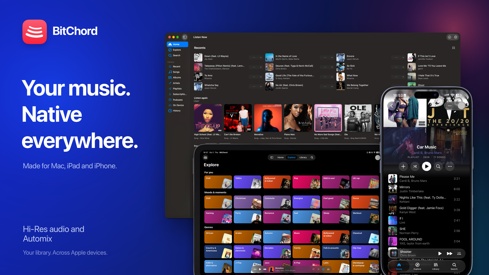

# BitChord for Apple Platforms



An unofficial Apple-platform port of [BitChord](https://github.com/kushagrasinghx/BitChord), the music client originally created by [Kushagra Singh](https://github.com/kushagrasinghx).

This project brings BitChord to macOS, iPhone, and iPad with a SwiftUI interface, shared Kotlin Multiplatform logic, and a Rust audio engine. It is an independent port; it is not affiliated with Google or YouTube.

## Platforms

- **macOS 15 or later**
- **iOS and iPadOS 18 or later**
- **Apple Silicon only.** The configured macOS, iOS device, and iOS Simulator targets are arm64; Intel Macs and Intel iOS simulators are not configured.

The project is source-first. iPhone and iPad users build and sign the app themselves in Xcode. A signed macOS package may be shared separately as a release.

## Features

The current codebase includes:

- YouTube Music search, browsing, and playback, with optional account sign-in.
- Configurable music sources and source modules, local music files, and WebDAV libraries.
- A native playback engine with downloads, queue management, gapless playback, crossfade, equalizer, and audio-route information.
- Lyrics from multiple providers, including word-synced lyrics where a source supplies them.
- Automix transitions with beat analysis. Optional analysis models can be downloaded in the app; Automix retains a fallback when they are not installed.
- Listen Together, which requires a compatible server address supplied by the listener.
- Widgets, Discord Rich Presence, and Last.fm or ListenBrainz scrobbling.
- Apple-platform audio options, including spatial processing and, on macOS, conditional bit-perfect output when the selected DAC and source format allow it.

Features that depend on external services, sources, audio routes, or optional models may behave differently as those dependencies change.

## Build from source

Builds currently require a Mac with Xcode and the Apple SDKs for the deployment targets above. Install these tools and make them available on `PATH`:

- Xcode, including its command-line tools.
- XcodeGen.
- A JDK supported by the Gradle wrapper.
- Rust with `rustup` and the Apple targets used by the native core.
- CMake, needed by the bundled Opus build.

Clone the repository:

```sh
git clone https://github.com/bagumamartin/BitChord.git
cd BitChord
```

The pinned upstream submodule is kept for source comparison and attribution; it is not a build dependency. Initialize it if you want the upstream source locally:

```sh
git submodule update --init --recursive
```

Before generating the project, change `BITCHORD_BUNDLE_ID` near the top of `AppleApp/project.yml` to a reverse-DNS identifier you control. The widget identifier and the `group.<bundle-id>` App Group identifier derive from it.

Build the shared framework and native audio framework, generate the Xcode project, and open it:

```sh
rustup target add aarch64-apple-darwin aarch64-apple-ios aarch64-apple-ios-sim
./scripts/build-shared-framework.sh
./scripts/build-native-core.sh
xcodegen generate --spec AppleApp/project.yml
open AppleApp/BitChord.xcodeproj
```

In Xcode, select the `BitChord` scheme, choose a Mac, iPhone, iPad, or Apple Silicon Simulator destination, then select your Apple Developer Team under the app and widget targets' **Signing & Capabilities**. The Team is per-developer and is not stored in the shared project configuration. For device signing, register the derived App Group with your developer account and enable it for both targets. The current entitlements are configured for development; review them, including the app sandbox setting, before preparing a distributed macOS build. The generated frameworks, Swift bindings, and Xcode project are build outputs and are ignored by Git.

`build-shared-framework.sh` builds the Debug framework by default. For a Release shared framework, run:

```sh
CONFIG=release ./scripts/build-shared-framework.sh
```

The native-core script builds Release frameworks for the configured Apple targets. Run both framework scripts again after changing code in `shared/` or `native-core/`.

### Optional Listen Together server

The app does not ship with a hosted Listen Together service. Enter a compatible server in the app, or set `LISTEN_TOGETHER_SERVER` in the environment or in the root `local.properties` file. With neither configured, the listener supplies a server in the app.

### Optional Automix models

Automix works without downloaded models, using its built-in analysis fallback. The app can offer the beat-analysis model and the larger vocal-analysis model separately. The developer helper `scripts/fetch-automix-models.sh` downloads and verifies both models into `AppleApp/Resources/Models/` for local builds.

## Disclaimer & Legal Notice

BitChord is an independent, unofficial third-party music player and client. It is not affiliated with or endorsed by Google LLC, YouTube Music, or the providers of any configured sources.

- **No media hosting:** BitChord is a client, not a music-hosting service. It accesses external sources and local libraries; downloaded tracks are stored on the listener's device.
- **Copyright and service terms:** Access through BitChord does not grant rights to any music or other content. You are responsible for ensuring your use complies with applicable law and the terms of any provider or API you access.
- **No ad or availability guarantee:** Third-party services can change their catalogs, access rules, availability, and ad behavior. This project makes no guarantee that a source will remain available or behave in a particular way.
- **No warranty and limitation of liability:** For GPLv3-covered portions, the software is provided without warranty and liability is limited as set out in Sections 15 and 16 of [`LICENSE`](LICENSE), except where applicable law requires otherwise or the parties agree in writing. This summary does not replace the license; separately licensed components remain subject to their own terms.
- **Copyleft:** GPLv3 permits redistribution, including for a fee, under its terms. Distributors of GPL-covered binaries must meet the corresponding-source and notice requirements. Other components have their own terms; see [`THIRD_PARTY_NOTICES.md`](THIRD_PARTY_NOTICES.md).

## Credits and licenses

This is an unofficial port of [BitChord by Kushagra Singh](https://github.com/kushagrasinghx/BitChord). The upstream source is pinned as a Git submodule at [`fe198ac`](https://github.com/kushagrasinghx/BitChord/tree/fe198ac); its source, per-file notices, and license are available in `vendor/bitchord-upstream` when the submodule is initialized. See the upstream repository's [maintainers and contributors](https://github.com/kushagrasinghx/BitChord/blob/fe198ac/MAINTAINERS.md) for upstream attribution.

Some analyzer code was ported from [Orchard](https://github.com/SFG5453/Orchard), by SFG545, through BitChord's Android implementation. The relevant files identify SFG545 and Kushagra Singh and retain their AGPLv3-or-later terms. The audio clarity contour also credits the [LastWave-native](https://github.com/Clash-Projects/LastWave-native) reference in its source and notices. The upstream README credits [binimum/am-lyrics](https://github.com/binimum/am-lyrics) for the Apple-like lyrics animation; that credit is preserved here.

The root project is licensed under the **GNU General Public License v3.0**; see [`LICENSE`](LICENSE). Some files and bundled dependencies carry additional licenses. See [`THIRD_PARTY_NOTICES.md`](THIRD_PARTY_NOTICES.md), the files in `LICENSES/`, `AppleApp/Resources/AudioLicenses/`, and individual source headers before redistributing or modifying those components.
